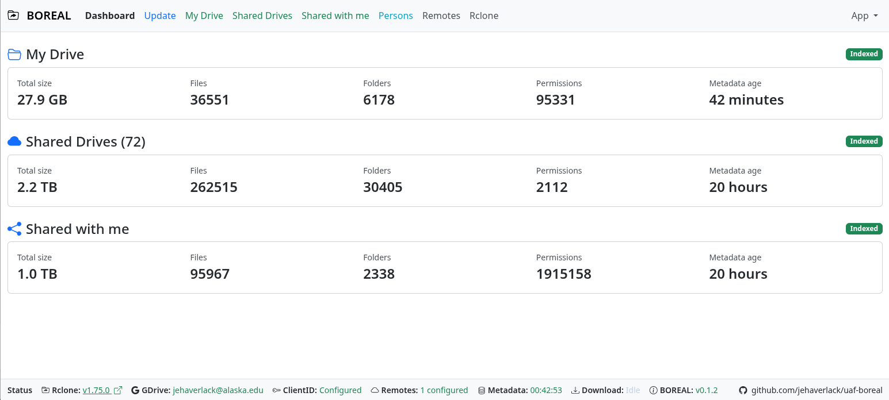

# BOREAL

**Browser-based Organizer for Rclone Exploration, Audit & Lookup**

| Attribute | Value |
| --- | --- |
| **Project** | Boreal |
| **Description** | Browser-based Organizer for Rclone Exploration, Audit and Lookup |
| **Author** | John Haverlack |
| **License** | MIT |
| **Version** | 1.0.1 |
| **Maturity** | STABLE |
| **Date** | 2026-09-02 |

> AI Attestation: Generative AI was used in the development of this codebase.
> The architecture and design goals are those of the author.

BOREAL is a local desktop application for inventorying, exploring, and auditing
Google Drive. It uses Rclone to collect metadata from My Drive, Shared with me,
and Shared Drives, then stores that inventory in a private local database for
fast searching and analysis. Guided, persistent jobs can download content or
copy selected My Drive and Shared with me content to an approved destination.

BOREAL runs on Linux, Windows, and macOS. Its browser interface is available
only on the local computer, and normal use does not require administrator or
root privileges.


## Why Use BOREAL?

BOREAL makes large Google Drive accounts easier to understand. It provides one
place to explore files, folders, ownership, sharing permissions, sizes, and
locally assigned tags without repeatedly querying Google Drive.

BOREAL can help answer questions such as:

- Which files shared with me belong to former users and may be at risk of being
  purged?
- Which large My Drive files can be migrated or deleted?
- Which permissions should be transferred or removed when someone leaves?
- Which permissions held by former users still need attention?
- Which documents need to be handed off to another person?
- Which My Drive documents should be moved to a Shared Drive?

BOREAL manages its own private Rclone installation, does not modify the user's
`PATH`, and never deletes migration sources. Google Drive copies require a
separately authorized read/write remote; routine inventory remains read-only.

## Dashboard Screenshot



## Install BOREAL

Download the binary matching your operating system and processor from the
[BOREAL v1.0.1 release](https://github.com/jehaverlack/uaf-boreal/releases/tag/v1.0.1).

| System | Processor | Download | Instructions |
| --- | --- | --- | --- |
| Linux | x86_64 / AMD64 | [Download](https://github.com/jehaverlack/uaf-boreal/raw/refs/tags/v1.0.1/dist/boreal-v1.0.1-linux-x86_64) | [Install on Linux](docs/Install-Linux.md) |
| Linux | ARM64 / AArch64 | [Download](https://github.com/jehaverlack/uaf-boreal/raw/refs/tags/v1.0.1/dist/boreal-v1.0.1-linux-aarch64) | [Install on Linux](docs/Install-Linux.md) |
| Linux | ARMv7 32-bit | [Download](https://github.com/jehaverlack/uaf-boreal/raw/refs/tags/v1.0.1/dist/boreal-v1.0.1-linux-armv7) | [Install on Linux](docs/Install-Linux.md) |
| Windows | x86_64 / AMD64 | [Download](https://github.com/jehaverlack/uaf-boreal/raw/refs/tags/v1.0.1/dist/boreal-v1.0.1-windows-x86_64.exe) | [Install on Windows](docs/Install-Windows.md) |
| macOS | Apple Silicon / ARM64 | [Download](https://github.com/jehaverlack/uaf-boreal/raw/refs/tags/v1.0.1/dist/boreal-v1.0.1-macos-aarch64) | [Install on macOS](docs/Install-MACOS.md) |
| macOS | Intel x86_64 | [Download](https://github.com/jehaverlack/uaf-boreal/raw/refs/tags/v1.0.1/dist/boreal-v1.0.1-macos-x86_64) | [Install on macOS](docs/Install-MACOS.md) |

Use the release
[SHA256SUMS](https://github.com/jehaverlack/uaf-boreal/raw/refs/tags/v1.0.1/dist/SHA256SUMS)
file to verify your download.

## Configure BOREAL

Start BOREAL and follow the Setup Progress checklist in the browser:

1. Allow BOREAL to download and verify its private Rclone executable.
2. Upload a Google OAuth Desktop Client ID JSON file. If needed, use
   **App → Create Google Client ID** for the separate creation wizard.
3. Authorize BOREAL's read-only My Drive remote in Google.
4. Optionally link a Google Sheets persons directory.
5. Run the initial metadata update.

The initial Rclone installation and metadata update require internet access.
Large Drive inventories, especially Shared Drives, may take several hours.

Closing the browser tab does not stop BOREAL. Use the BOREAL desktop tray or
menu-bar icon to reopen the WebUI or quit BOREAL. You can also use
**App → Quit BOREAL** or press **Ctrl-C** in the terminal. BOREAL asks for
confirmation before quitting when a metadata update, migration, or download is
active.

To install a newer release without losing configuration or inventory data, see
[Upgrading BOREAL](docs/UPGRADING.md). BOREAL detects new releases but does not
replace its running executable automatically.

Architecture and security details are available in
[DESIGN.md](docs/DESIGN.md). BOREAL is distributed under the
[MIT License](LICENSE).

## Building BOREAL

The repository includes setup scripts for Linux and macOS release-build hosts.
Run these scripts as a regular user from the repository root. They install or
configure a per-user Rust toolchain and may prompt before updating your shell
startup file.

### Linux Build Environment

The Linux setup script currently supports Debian and Ubuntu systems with
`apt`. It uses `sudo` to install the native build tools, `jq`, and the
cross-compilers needed for enabled Linux and Windows targets. Rust itself is
installed for the current user under `~/.cargo` and `~/.rustup`.

```bash
./tools/setup-build-linux.sh
```

If you allow the script to update `~/.bashrc`, open a new terminal or reload it
before building:

```bash
source ~/.bashrc
```

### macOS Build Environment

The macOS setup script requires Apple's Xcode Command Line Tools. If they are
missing, it starts Apple's installer and asks you to rerun the script after the
installation finishes. It installs Rust for the current user and installs
`jq` under `~/.local/bin` when needed.

```bash
./tools/setup-build-macos.sh
```

If you allow the script to update your shell configuration, open a new terminal
or reload the file reported by the script before building.

### Select Release Targets

Release targets are controlled by the Boolean values under `BUILD_TARGETS` in
[`metadata.json`](metadata.json). Set a target to `true` to include it or
`false` to skip it:

```json
"BUILD_TARGETS": {
  "x86_64-unknown-linux-gnu": true,
  "aarch64-unknown-linux-gnu": false,
  "armv7-unknown-linux-gnueabihf": false,
  "x86_64-pc-windows-gnu": false,
  "x86_64-apple-darwin": true,
  "aarch64-apple-darwin": true
}
```

The build host determines which enabled targets it can produce:

| Build host | Supported output targets |
| --- | --- |
| Linux | Linux x86_64, Linux ARM64, Linux ARMv7, and Windows x86_64 |
| macOS | macOS Intel x86_64 and macOS Apple Silicon ARM64 |

macOS binaries must be built on macOS. When assembling a multi-platform
release, copy the macOS artifacts into the same `build/` directory used on the
Linux release host.

### Run the Release Build

After selecting targets, run:

```bash
./tools/build-release.sh
```

The script validates every `BUILD_TARGETS` entry, reads the release version
from `METADATA.version`, builds enabled targets supported by the current host,
and writes versioned binaries to `build/`. It stops with an actionable error if
an enabled Rust target, cross-compiler, or required utility is missing.

For the complete versioning, staging, checksum, and release process, see
[`tools/WORKFLOW.md`](tools/WORKFLOW.md).
